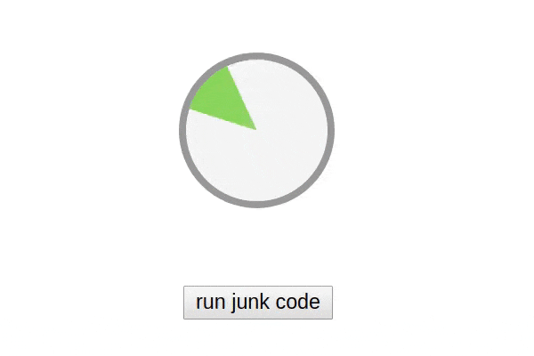
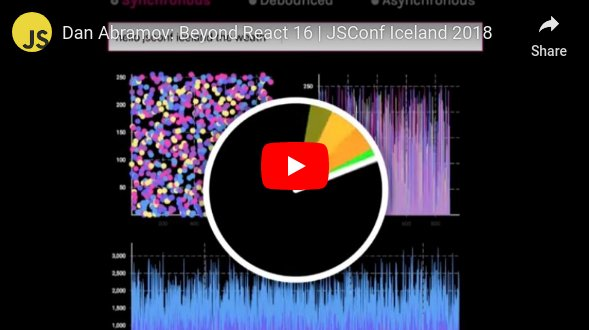

# Performance clock

  

> Detect performance lag in your app

[demo](https://platane.github.io/performance-clock/demo.html)

## Inspiration

I stole it from Dan Abramov JsConf Iceland talk.

## Usage

I recommand using it as bookmarklet.

[installation](https://platane.github.io/performance-clock/installation.html)
